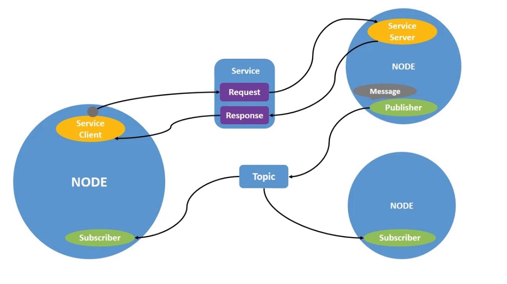
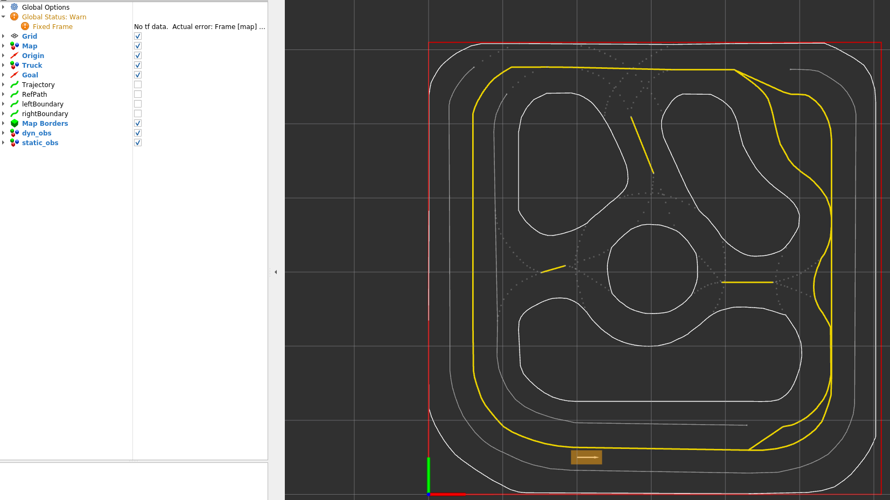
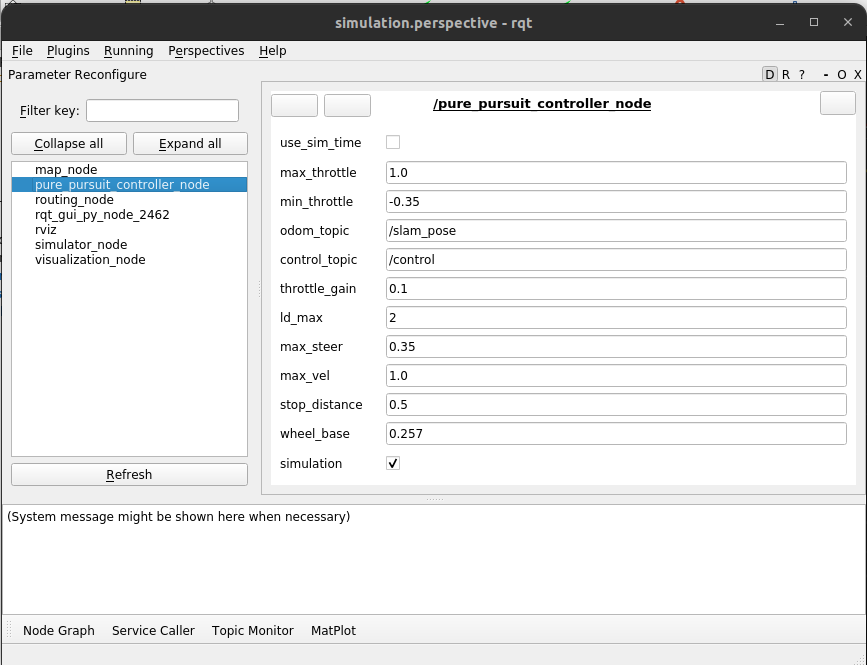
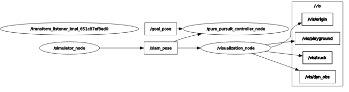
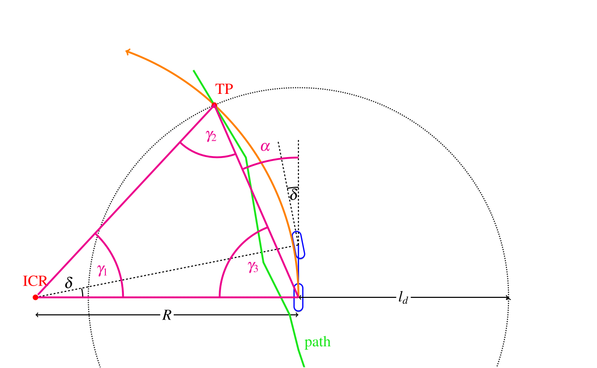

# Lab 1 - Introduction to ROS 2
**[Due 11:59PM Friday, February 13]**

Welcome to the "lab" component of Intelligent Robotic Systems! Over the semester, we will implement various methods for robot decision-making, both in simulated environments and on physical robotic hardware. In this lab we introduce you to essential concepts in ROS 2 (the Robot Operating System), which will be solidified by analyzing and writing your own ROS 2 code. You will then execute your code both in simulation and on your mini truck, which you'll then demonstrate to a course TA. This lab consists largely of reading and learning the basics of how to run your code for future labs. Although collaboration is always encouraged for labs in this course, we strongly encourage that each group member individually reads through this entire lab, as any future lab work will be difficult without this core understanding. Of course, to get the most out of this course and these labs, you should aim to fully understand and contribute to each assignment. If you plan to list ROS on your resume or CV, it will be assumed that you understand the core concepts that we introduce.

There are **5 tasks** in this lab, and you will need to push your code after completing `pure_pursuit.py` in **tasks 1-5**, and demonstrate your code to a TA.
This lab can be long so **start early**. If you need input outside of lab OH, you can ask us a question on Ed.

## Objectives

The following are the objectives of this lab:
- Get familiar with basic ROS 2 concepts.
- Be able to build and run a provided ROS 2 package.
- Get familiar with the visualization and simulation tools for this class.
- Get familiar with the mini truck platform.
- Learn how to interface with ROS 2 subscribers, publishers, and parameter servers.
- Learn how to run your own software on the mini truck.
- Develop and test a goal-reaching controller for your robot.

## Setting Up ROS 2

Before we get started, you need to set up the Git Repository and configure your computer for the lab. Please read through the detailed instructions in the [main repository README](https://github.com/SafeRoboticsLab/ECE346).

# Intro to ROS 2

ROS 2 is an open-source framework for controlling robotic components from a computer. It is the successor to ROS 1, built on top of DDS (Data Distribution Service) for more robust, real-time communication. You can generally think of ROS 2 as a graph or network of independent **ROS nodes**. Each ROS node communicates via **ROS messages** by **publishing** and **subscribing** to **ROS topics**. Published messages will be received by any node in the graph subscribed to the corresponding **ROS topic**.

Most roboticists today create ROS 2 software using either Python ([rclpy](https://docs.ros2.org/foxy/api/rclpy/index.html)) or C++ ([rclcpp](https://docs.ros2.org/foxy/api/rclcpp/index.html)), as both languages are well-supported in the ROS 2 community. In this class, our default working language is Python. However, you will find that it is simple to adapt ROS 2 in the other language once you master one of them.

## Key Concepts in ROS 2

**[DDS Discovery](https://docs.ros.org/en/foxy/Concepts/About-Different-Middleware-Vendors.html)**: Unlike ROS 1, ROS 2 does **not** require a central ROS Master. Instead, nodes discover each other automatically using DDS (Data Distribution Service). This makes the system more robust — if one node crashes, the rest continue to operate normally.

**[ROS 2 Nodes](https://docs.ros.org/en/foxy/Tutorials/Understanding-ROS2-Nodes.html)**: A node is a process that performs some computation. For example, a robot with a control system typically consists of many nodes. A robot can have many nodes, each meant to operate at a fine-grained level. For example, a node for processing camera images, a node that controls the robot's motors, a node that performs localization, a node that performs path planning, etc. In ROS 2, nodes are typically implemented as Python or C++ classes that inherit from `rclpy.node.Node`.

**[ROS 2 Messages](https://docs.ros.org/en/foxy/Concepts/About-ROS-Interfaces.html)**: Communication between ROS nodes is done through messages. A ROS message is a simple data structure, comprising integers, floating-point numbers, booleans, and arrays of those data types, defined by a `.msg` file. Messages can include arbitrarily nested structures and arrays as defined by the user.

**[ROS 2 Topics](https://docs.ros.org/en/foxy/Tutorials/Topics/Understanding-ROS2-Topics.html)**: ROS 2 nodes communicate with one another by publishing and subscribing to topics that contain messages. Topics provide the channel ID for the correct communication.

**[ROS 2 Services](https://docs.ros.org/en/foxy/Tutorials/Services/Understanding-ROS2-Services.html)**: A ROS 2 service is a type of communication that allows request-response interaction between nodes. This may be necessary for robotics applications where you need to change the robot's mode and receive acknowledgment. Services depend on `.srv` files. Services do not use topics — they operate on a separate request-response mechanism and are designed for synchronous communication. The node offering the service (the server) defines a service interface. Another node (the client) sends a request to the server. The server processes the request and sends back a response.

**[Colcon Build System](https://colcon.readthedocs.io/en/released/)**: ROS 2 uses `colcon` as its build tool (replacing `catkin_make` from ROS 1). Colcon orchestrates the building of multiple packages in the correct dependency order.

**[Ament Build System](https://docs.ros.org/en/foxy/Guides/Ament-CMake-Documentation.html)**: Ament is the underlying build system used by ROS 2 packages. There are two variants: `ament_cmake` (for C++ and mixed packages) and `ament_python` (for pure Python packages). Our packages use `ament_cmake` with Python support.

**[ROS 2 Workspace](https://docs.ros.org/en/foxy/Tutorials/Workspace/Creating-A-Workspace.html)**: A workspace is a directory used to build and install multiple ROS 2 packages. Anything we do with ROS 2 will be inside of a workspace (containing a `src` subdirectory with our packages).

**[ROS 2 Package](https://docs.ros.org/en/foxy/Tutorials/Creating-Your-First-ROS2-Package.html)**: A package is a directory that contains source code for your ROS 2 nodes, descriptions for your custom messages and services, or other libraries. Each package contains a `package.xml` manifest and either a `CMakeLists.txt` or `setup.py`.

**[Parameters](https://docs.ros.org/en/foxy/Tutorials/Parameters/Understanding-ROS2-Parameters.html)**: In ROS 2, parameters are **per-node** (unlike ROS 1's global parameter server). Each node declares and manages its own parameters, which can be set from launch files or YAML config files and changed at runtime using `ros2 param set`.


***Figure 1**: A ROS graph example containing three nodes*

Putting those terms together, consider **Figure 1**. We have three nodes connected through topics. Each node is an independent process responsible for a single task — one might read sensor data, another might process it, and a third might act on the result. They communicate by publishing and subscribing to shared topics, without needing to know anything about each other's implementation.

This modularity is the main advantage of ROS. Want to add a new feature, like logging data to disk? Just create a new node that subscribes to the same topic — no changes needed to any existing code. Want to swap out a sensor for a different model? Just make sure the new driver node publishes the same message type, and every downstream node continues to work. Each node can be developed, tested, and debugged independently, making it much easier to build complex robotic systems as a team.

## ROS Workspace

A workspace is a directory (folder) that contains all ROS packages. You can think of this as the main folder that contains everything you need for a specific project or lab. A workspace can store multiple packages and allows us to build all of the packages at the same time using `colcon build`. If you don't use a workspace, you can build packages independently, however, this can be very tedious when there are several packages that need to be built.

In our Docker environment, the workspace is located at `/ros2_ws`, with all source code under `/ros2_ws/src`.

## ROS Package

As previously mentioned, a package refers to a directory that contains source code for ROS nodes, services, messages, etc. Packages are located inside the workspace under the `src` sub-directory. A given project workspace will likely contain many packages inside `src`.

ROS 2 provides a tool to create a package:

```bash
ros2 pkg create <package_name> --dependencies [dep1] [dep2]
```

Let's inspect the structure of our `racecar_ece346` package. A typical ROS 2 package contains:

- **`launch/`** — Launch files (Python scripts) for starting one or multiple nodes.
- **`scripts/`** — Executable Python scripts containing node implementations.
- **`config/`** — YAML configuration files for node parameters.
- **`msg/` and `srv/`** — Custom message and service definitions (if any).
- **`package.xml`** — Manifest file containing metadata: package name, version, description, license, and dependencies.
- **`CMakeLists.txt`** — Build configuration telling colcon which files to install and which packages to link.

For now, we do not need to worry about `package.xml` and `CMakeLists.txt` as they will be provided for most of the packages in this class.

## Building a ROS 2 Package

You should have already set up your Docker environment following the [main repository README](https://github.com/SafeRoboticsLab/ECE346). If not, follow those instructions first.

Let's build the code in our workspace. Inside the Docker container:

```bash
# Build all ROS 2 packages
colcon build --symlink-install
# Source the workspace overlay
source install/setup.bash
```

The `--symlink-install` flag creates symbolic links instead of copying Python files, which means **changes to `.py` files take effect immediately** without rebuilding.

After building, your workspace will contain three new directories alongside `src`:

**Source (`src`) Directory**: Contains all ROS 2 packages and source code.

**Build (`build`) Directory**: Where colcon builds all code. Contains intermediate build artifacts.

**Install (`install`) Directory**: Contains the built and installable packages. This is where `setup.bash` lives.

**Log (`log`) Directory**: Contains build and runtime log files.

## ROS Nodes

Simply put, a node is a process that performs computation. Nodes are combined together into a graph and communicate with one another using streaming messages through topics, sending requests through services, and managing parameters. ROS nodes are written in Python (rclpy) or C++ (rclcpp).

In ROS 2, a node is typically a class that inherits from `rclpy.node.Node`:

```python
import rclpy
from rclpy.node import Node

class MyNode(Node):
    def __init__(self):
        super().__init__('my_node_name')
        self.get_logger().info('Node started!')
```

### Making a Node Executable

After making changes to your code, you need to source the workspace. Run the following inside the Docker container:

```bash
# Build ROS 2 packages (only needed if you changed CMakeLists.txt, .msg, or .srv files)
colcon build --symlink-install
# Source the workspace (needed every time you open a new terminal)
source install/setup.bash
```

**Important**: You need to run `colcon build` every time you define a new message type, build a new service, or add a new package. For Python file changes, no rebuild is needed thanks to `--symlink-install`. Run `source install/setup.bash` every time you **open a new terminal** or after a build. A very common error is for launch files or nodes to be "not found" if you forget to run this command.

### Running ROS 2 Nodes with `ros2 launch`

To run our Lab 1 simulation, we use the launch file `lab1_simulation_launch.py`:

```bash
ros2 launch racecar_ece346 lab1_simulation_launch.py
```

The key idea of a launch file is to start our node(s) and assign values to parameters using a single command. In ROS 2, launch files are Python scripts (rather than XML as in ROS 1).


***Figure 3a**: RViz2 visualization tool*


***Figure 3b**: RQT GUI*

Two windows should pop up when you run the above command. The first window, shown in **Figure 3a**, is managed by [RViz2](https://github.com/ros2/rviz). In the RViz window, you should see an orange rectangle which represents your robot. RViz will serve as the main visualization tool in our class. It is highly configurable, and we will introduce more functionalities (such as visualizing the map and planned routes) in future labs.

The second window, shown in **Figure 3b**, is the [RQT](https://docs.ros.org/en/foxy/Concepts/About-RQt.html) GUI. It is a versatile tool that allows you to inspect your ongoing ROS processes, visualize data, and tune parameters at runtime. RQT is highly configurable — you can adjust the layout and panels and even create your own plugins.


***Figure 4**: Node graph of Lab 1 from RQT GUI.*

From the RQT GUI, let's first take a look at the node graph page. If the node graph is not shown on your GUI, you can add one from **Plugins > Introspection > Node Graph** on the menu bar. **Figure 4** shows a node graph of Lab 1. The `/visualization_node` handles visualization. The `/simulator_node` simulates the dynamics of our robot after executing control commands from the `/pure_pursuit_controller_node`. All these nodes are started with a single `ros2 launch` command. In the next section, we will take a look at the basic functionality of `ros2 launch`.

## `ros2 launch` Basics ##
`ros2 launch` is a tool for easily launching multiple ROS 2 nodes, as well as setting parameters. `ros2 launch` takes in one or more Python launch files that specify the parameters to set and nodes to launch. In Lab 1, you just need to know how to interpret a launch file and pass arguments during launch.

### Reading a Launch File ###
Let's **take a look** at the launch file you just used. You can find it at `src/racecar_ece346/ece346/Lab1/launch/lab1_simulation_launch.py`.

The launch file is a Python script that returns a `LaunchDescription` containing:

1. **`DeclareLaunchArgument`** — Defines arguments that can be passed from the command line (similar to ROS 1's `<arg>` tags).
2. **`IncludeLaunchDescription`** — Includes other launch files, allowing nesting (similar to ROS 1's `<include>` tags). Arguments are forwarded via `launch_arguments`.
3. **`Node`** — Starts a ROS 2 node, specifying its package, executable, name, and parameters.

The parameter file (`lab1.yaml`) is loaded into each node at startup, providing initial values for parameters like `max_throttle`, `max_vel`, `wheel_base`, etc.

### Passing Arguments in `ros2 launch` ###

To pass an argument, append `argument_name:=value` to the launch command. For example:

```bash
ros2 launch racecar_ece346 lab1_simulation_launch.py param_file:=/path/to/custom_params.yaml
```

### Getting ROS 2 Parameters ###
In ROS 2, parameters are **per-node** and managed through the Node API. A node declares parameters and reads them at startup:

```python
# Declare a parameter with a default value
self.declare_parameter('max_vel', 0.5)
# Read the parameter value
self.max_vel = self.get_parameter('max_vel').value
```

Parameters can also be set at runtime using the command line:
```bash
ros2 param set /pure_pursuit_controller_node max_vel 1.5
```

Or interactively through the **Dynamic Reconfigure** plugin in RQT (**Plugins > Configuration > Dynamic Reconfigure**).

## ROS 2 Messages, Topics, Publishers and Subscribers ##
One primary function of ROS 2 is the communication between nodes using messages. The publisher sends out the message to ROS topics, and the subscribers receive the messages. This section will use two examples to understand how publishers and subscribers work in ROS 2. For visualization, the node graph in **Figure 4** indicates which nodes are publishers or subscribers to a certain topic.

### ROS 2 Publisher ###
First, let us look at a simple ROS publisher. In this Python code, we have a node named `talker` that sends messages to a topic named `chatter` at a rate of 10 Hz.

```python
#!/usr/bin/env python3
import rclpy
from rclpy.node import Node
from std_msgs.msg import String

class Talker(Node):
    def __init__(self):
        super().__init__('talker')
        self.pub = self.create_publisher(String, 'chatter', 10)
        self.timer = self.create_timer(0.1, self.timer_callback)  # 10 Hz

    def timer_callback(self):
        msg = String()
        msg.data = f'hello world {self.get_clock().now().to_msg()}'
        self.get_logger().info(msg.data)
        self.pub.publish(msg)

def main(args=None):
    rclpy.init(args=args)
    node = Talker()
    rclpy.spin(node)
    node.destroy_node()
    rclpy.shutdown()

if __name__ == '__main__':
    main()
```

Now, let's break down the code.

```python
#!/usr/bin/env python3
```

Every Python ROS 2 node will have this declaration at the top. This line ensures your script is executed as a Python 3 script.

```python
import rclpy
from rclpy.node import Node
from std_msgs.msg import String
```

You need to import `rclpy` if you are writing a ROS 2 node in Python. We also import the `Node` base class that our node will inherit from. Finally, we import our desired message type — here, `String` from `std_msgs.msg`.

```python
class Talker(Node):
    def __init__(self):
        super().__init__('talker')
```

In ROS 2, nodes are implemented as classes that inherit from `Node`. The `super().__init__('talker')` call registers this node with the name `talker`.

```python
self.pub = self.create_publisher(String, 'chatter', 10)
```

Here, we create a publisher. `create_publisher()` takes three arguments: the message type (`String`), the topic name (`'chatter'`), and the queue size (`10`). The queue size limits the amount of queued messages for the case where a subscriber is not receiving messages fast enough.

```python
self.timer = self.create_timer(0.1, self.timer_callback)  # 10 Hz
```

In ROS 2, we use a timer to call a function periodically, Here we create a timer that fires every 0.1 seconds (10 Hz).

```python
def timer_callback(self):
    msg = String()
    msg.data = f'hello world {self.get_clock().now().to_msg()}'
    self.get_logger().info(msg.data)
    self.pub.publish(msg)
```

The timer callback constructs a `String` message, logs it using `self.get_logger().info()`,  and publishes it using `self.pub.publish()`.

```python
def main(args=None):
    rclpy.init(args=args)
    node = Talker()
    rclpy.spin(node)
    node.destroy_node()
    rclpy.shutdown()
```

The `main()` function initializes the ROS 2 Python client library, creates our node, and calls `rclpy.spin()` to keep the node running and processing callbacks until it is shut down (e.g., with `Ctrl+C`). Afterwards, we clean up the node and shut down.

### Task 1: Set up a publisher for the ServoMsg message ###

Now you know how to publish a ROS 2 message. Let's write our first ROS 2 code! Open your `pure_pursuit.py` file in the text editor of your choice (file path: `src/racecar_ece346/ece346/Lab1/scripts/controller/pure_pursuit.py`). Your first task is to set up a missing publisher in the function `setup_publisher` following instructions under **TODO**. Make sure you read through the code to get an understanding of variable names (e.g., the topic name). You can find the ServoMsg definition in `src/racecar_msgs/msg/ServoMsg.msg`. **Once you are finished**, you can proceed to the next task.

### ROS 2 Subscriber ###
The code for the subscriber is very similar to the publisher and can be seen below. Now, instead of publishing to the `chatter` topic, we are subscribing to it.

```python
#!/usr/bin/env python3
import rclpy
from rclpy.node import Node
from std_msgs.msg import String

class Listener(Node):
    def __init__(self):
        super().__init__('listener')
        self.create_subscription(String, 'chatter', self.callback, 10)

    def callback(self, msg):
        self.get_logger().info(f'I heard: {msg.data}')

def main(args=None):
    rclpy.init(args=args)
    node = Listener()
    rclpy.spin(node)
    node.destroy_node()
    rclpy.shutdown()

if __name__ == '__main__':
    main()
```

Let us now break down the subscriber code.

```python
class Listener(Node):
    def __init__(self):
        super().__init__('listener')
        self.create_subscription(String, 'chatter', self.callback, 10)
```

We define a `Listener` class that inherits from `Node`. In the constructor, we create a subscription using `self.create_subscription()`. It takes four arguments: the message type (`String`), the topic to subscribe to (`'chatter'`), the callback function (`self.callback`), and the queue size (`10`).

```python
def callback(self, msg):
    self.get_logger().info(f'I heard: {msg.data}')
```

The `callback` function is called every time a new message arrives on the `chatter` topic. The message object is passed as the argument `msg`. Here we simply log the received data.

```python
def main(args=None):
    rclpy.init(args=args)
    node = Listener()
    rclpy.spin(node)
    node.destroy_node()
    rclpy.shutdown()
```

Just like the publisher, we initialize rclpy, create our node, and `spin()` to keep the node alive and processing incoming messages until shutdown.

### Task 2: Set up a subscriber for the Odometry message ###
Open your `pure_pursuit.py` file. Your second task is to set up a missing subscriber in the function `setup_subscriber` following instructions under **TODO**. **Once you are finished**, you can proceed to the next task.

### Inspecting ROS 2 Messages using `ros2 topic` and `ros2 interface` ###
Now you are an expert in setting up ROS 2 publishers and subscribers. However, you may be wondering how to decode those ROS 2 messages or figure out what's inside of each datatype in order to write a callback function. The command line tools `ros2 topic` and `ros2 interface` are designed for this usage.

Let's try this out! First, make sure your simulation is still running. Now, open a new terminal into the container:
```bash
docker compose exec ros bash
source install/setup.bash
```

Then try these commands:

```bash
# List all active topics
ros2 topic list

# Show information about a topic (type, publishers, subscribers)
ros2 topic info <topic_name>

# Print messages from a topic in real-time
ros2 topic echo <topic_name>

# Show the data structure of a message type
ros2 interface show <message_type>
# Example:
ros2 interface show geometry_msgs/msg/PoseStamped
ros2 interface show racecar_msgs/msg/ServoMsg
```

A full list of `ros2 topic` and `ros2 interface` subcommands can be found with `ros2 topic --help` and `ros2 interface --help`.

### Task 3: Fill in the subscriber callback function ###
Open your `pure_pursuit.py` file. Your third task is to fill in the missing code of the function `goal_callback` following instructions under **TODO**.

Once you are finished, **restart** the simulation (i.e., `ros2 launch racecar_ece346 lab1_simulation_launch.py`). From the RViz simulator, you can add a desired goal location by selecting **2D Goal Pose** from the top panel and then clicking a point on the map. You will see that the position of your clicked point is printed on your terminal.

### Task 4: Construct and publish a ROS message ###

Open your `pure_pursuit.py` file. Your fourth task is to fill in the missing code of the function `publish_control` following instructions under **TODO**. **Once you are finished**, you can proceed to the next task.

## Goal Reaching Controller ##

As a reminder, in this lab, you are implementing a simple goal-reaching controller. We will use a proportional controller for the throttle, and a pure pursuit controller for steering.

### Throttle Control ###
Our robot can control its acceleration through the motor's throttle input. In this Lab, we will implement a proportional controller to track reference speed $V_{ref}$.

$a = K_p(V_{ref}-V_{robot})$

### Steering Control ###
The pure pursuit method is a geometry-based algorithm to determine desired steering angle for a car to follow a path. As shown in Figure 5, pure pursuit calculates the steering angle $\delta$ to ensure the vehicle reaches the target point (**TP**) according to the kinematic bicycle model. This [tutorial](https://thomasfermi.github.io/Algorithms-for-Automated-Driving/Control/PurePursuit.html) provides an excellent interactive explanation of the pure pursuit algorithm.


***Figure 5**: Geometric Interpretation of Pure-Pursuit Algorithm. [[source](https://thomasfermi.github.io/Algorithms-for-Automated-Driving/Control/PurePursuit.html)]*

In short, you can obtain the steering angle $\delta$ by the equation below, where $L$ is the wheelbase of the robot, $\alpha$ is the relative angle of the look-ahead point w.r.t the robot, and $l_d$ is the distance between the robot and the look-ahead point.

$\delta = \arctan \left(\frac{2 L \sin(\alpha)}{l_d}\right)$

In this lab, we assume the reference path is the straight line connecting your robot and goal point. Therefore, the **TP** is a point on this line segment defined by user parameters.

### Task 5: Implement the goal reaching controller ###
Open your `pure_pursuit.py` file. You will finish the function `planning_thread` following the implementation details under the **TODO** block. This task concludes all coding parts of Lab 1. Relaunch the simulation, set **2D Goal Pose** in RViz, and drive your robot towards the goal point. The default parameters should work well in the simulation if your implementation is correct.

You can also tune the controller at runtime using **Dynamic Reconfigure** in RQT (**Plugins > Configuration > Dynamic Reconfigure**). Try adjusting `max_vel` and `throttle_gain` to see how they affect behavior.

# Intro to Trucks
Details on the mini truck platform and on-hardware deployment will be released on Monday.
