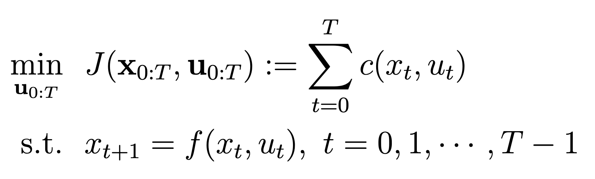
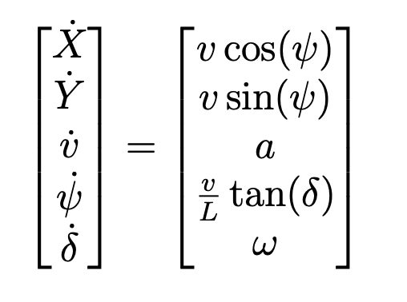
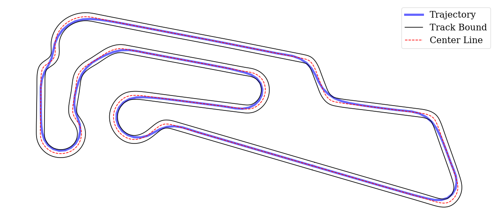
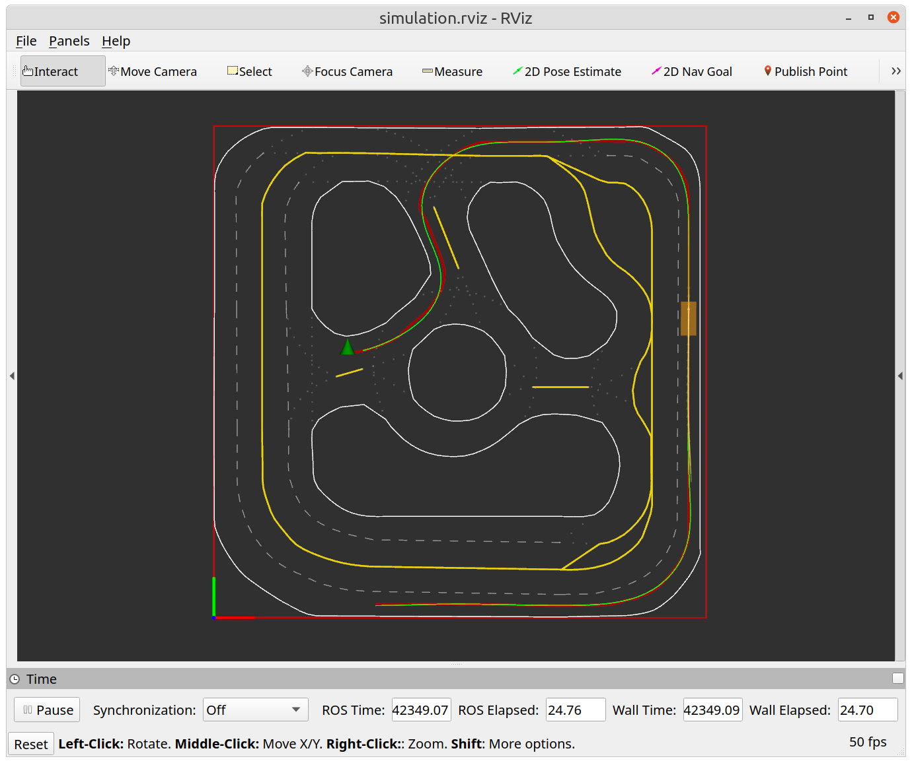

# Lab 1 - Trajectory Planning with ILQR

**[Due 11:59PM Friday, February 20]**

This lab will focus on the fundamental robot trajectory planning problem using optimization-based methods. We will first express the trajectory planning problem as an optimal control problem and look into vehicle models that govern our robot's equations of motion. Then, we will utilize the iterative linear quadratic regulator (ILQR) to generate locally optimal trajectories and policy. In addition, we will design a receding horizon trajectory planner using your ILQR and test them on the simulator and the real robot.

There are **4 tasks** in this lab, and you will need to submit (push) your code and demo to a TA.

**Note**: Make sure you have **pulled the code from upstream** into your repository and rebuilt the Docker image. If git asks you to specify how to reconcile divergent branches, run this once:
```bash
git config pull.rebase false
```
Then pull and rebuild:
```bash
git pull upstream SP2026
./start.sh build
```

If you get a **merge conflict** on a file you modified (e.g. `pure_pursuit.py`), you can resolve it by keeping your version:
```bash
git checkout --ours <path-to-conflicting-file>
git add <path-to-conflicting-file>
git commit
```
For example:
```bash
git checkout --ours src/racecar_ece346/ece346/Lab0/scripts/controller/pure_pursuit.py
git add src/racecar_ece346/ece346/Lab0/scripts/controller/pure_pursuit.py
git commit
```

Then start the container and build the ROS 2 workspace:
```bash
./start.sh
# Inside the container:
cd /ros2_ws && colcon build --symlink-install && source install/setup.bash
```


## Software Structure
In this lab, you will build a trajectory planner for our robot. Specifically, we will develop the ILQR planner under the directory [`src/racecar_ece346/ece346/Lab1`](https://github.com/SafeRoboticsLab/ECE346/tree/SP2026/src/racecar_ece346/ece346/Lab1). 

***Figure 1**: Software Structure for lab 1*

We will implement the ILQR algorithm in the [`ILQR`](https://github.com/SafeRoboticsLab/ECE346/blob/SP2026/src/racecar_ece346/ece346/Lab1/scripts/ILQR/ilqr.py) class and test it in the Jupyter Notebook [`task1.ipynb`](https://github.com/SafeRoboticsLab/ECE346/blob/SP2026/src/racecar_ece346/ece346/Lab1/scripts/task1.ipynb). After this, we will develop open-loop and receding horizon trajectory planning algorithms with ROS 2 inside the [`TrajectoryPlanner`](https://github.com/SafeRoboticsLab/ECE346/blob/SP2026/src/racecar_ece346/ece346/Lab1/scripts/traj_planner.py) class and compare their performances in simulation and on the real robot.

## Trajectory Planning by Optimization
 We can formulate a trajectory planning problem as a discrete-time optimal control problem with a finite horizon $T$:

where we want to find a desired control sequences $u_{0:T} := (u_0, \cdots, u_T)$ that leads to a trajectory $x_{0:T} := (x_0, \cdots x_T)$, minimizes the cost $J$ over next $H$ steps.

## Robot Dynamics $f(x_t, u_t)$

Throughout this semester, we will use the kinematic bicycle model to describe the 2D motion of ground vehicles. As shown the **Figure 2**, instead of modeling all four wheels, we combine the front wheels as a single wheel at $F$, and represent both rear wheels as a single wheel at $R$. The steering angle $\delta$ is the angle between the front wheel and the longitudinal axis of the robot.


***Figure 2**: Kinematic Bicycle Model.*

 We assume the entire robot is a point mass at  position, and the heading angle of the robot is $\psi$. The longitudinal velocity of the robot is $v$, and the steering angle is $\delta$. In addition, we also assume tires are under no-slip conditions so that both wheels' velocities align with their directions.

 Let us consider the state of robot 
. Under the kinematic bicycle model, the system dynamics can be expressed as



where the system has control  as $a$ is the longitudinal acceleration ($[m/s^2]$) and ${\omega}$ is the rate of steering ($[rad/s]$).

This kinematic bicycle dynamic has been implemented in the [`Bicycle5D`](https://github.com/SafeRoboticsLab/ECE346/blob/SP2026/src/racecar_ece346/ece346/Lab1/scripts/ILQR/dynamics/bicycle5d.py) class.
In addition, we provide you with very efficient implementations of trajectory rollout and derivative using [Jax](https://jax.readthedocs.io/en/latest/). Specifically, you will find [`integrate_forward_np`](https://github.com/SafeRoboticsLab/ECE346/blob/SP2026/src/racecar_ece346/ece346/Lab1/scripts/ILQR/dynamics/bicycle5d.py) and
[`get_jacobian_np`](https://github.com/SafeRoboticsLab/ECE346/blob/SP2026/src/racecar_ece346/ece346/Lab1/scripts/ILQR/dynamics/bicycle5d.py) useful for your ILQR. Please refer to their docstrings for instructions.

## Cost Function $c_t(x_t, u_t)$
One way to solve the optimal control problem posed above is using ILQR, which will find locally optimal control sequences by minimizing the cost function. Typical costs for our robot include deviation from the reference trajectory and velocity, penalties for large control values and collision, etc. By combining various cost functions with different weights, you can generate characteristic behaviors using your ILQR algorithm. As the example given in **Figure 3**, the ILQR finds a time-optimal trajectory in a racetrack, whose centerline and track boundary are provided.



***Figure 3**: Trajectory around [Motorsport Arena Oschersleben](https://www.racingcircuits.info/europe/germany/oschersleben.html) generated by ILQR.*

We have implemented a set of cost functions within the [`Cost`](https://github.com/SafeRoboticsLab/ECE346/blob/SP2026/src/racecar_ece346/ece346/Lab1/scripts/ILQR/cost/cost.py) class, whose parameters can be defined by your configuration file. The description of each cost function and its parameters can be found in the code. In addition, we provide you with very efficient implementation to obtain Jacobian and Hessian of the cost function using [Jax](https://jax.readthedocs.io/en/latest/). Specifically, you will find [`get_derivatives_np`](https://github.com/SafeRoboticsLab/ECE346/blob/SP2026/src/racecar_ece346/ece346/Lab1/scripts/ILQR/cost/cost.py) and [`get_traj_cost`](https://github.com/SafeRoboticsLab/ECE346/blob/SP2026/src/racecar_ece346/ece346/Lab1/scripts/ILQR/cost/cost.py) useful for your ILQR. Please refer to their docstrings for instructions.

**In lab 1, cost parameters for all tasks are provided. You are certainly welcome but not required to fine-tune those parameters.**

### Task 1: Implementing ILQR Algorithm
Unlike the tasks you had in lab 0, task 1 is very open-ended. You will need to complete the main ILQR loop in the [`plan`](https://github.com/SafeRoboticsLab/ECE346/blob/SP2026/src/racecar_ece346/ece346/Lab1/scripts/ILQR/ilqr.py) function of [`ILQR`](https://github.com/SafeRoboticsLab/ECE346/blob/SP2026/src/racecar_ece346/ece346/Lab1/scripts/ILQR/ilqr.py) class following pseudocodes provided in the ILQR handout.

The `plan` function takes in **the initial state** $x_0$ and **optional initial control sequences** . After optimization using ILQR, it outputs a **dictionary** containing **planned trajectory** $x_{0:T}$, **control sequences** $u_{0:T}$, **feedback gain** $\{K_t\}$, and other information.

We have provided helper functions to compute cost and system rollout, as well as their derivatives. Detailed information can be found in **the comment block of the `plan` function**. Once finished, test your planner with provided Jupyter Notebook [`task1.ipynb`](https://github.com/SafeRoboticsLab/ECE346/blob/SP2026/src/racecar_ece346/ece346/Lab1/scripts/task1.ipynb) and take a video of your visualization results to upload to Canvas.

#### Running the Notebook inside Docker

To run the notebook, you need to attach VS Code to the running Docker container. Follow these steps:

1. Make sure you have the **Dev Containers** extension installed in VS Code (search for "Dev Containers" by Microsoft in the Extensions panel, `Ctrl+Shift+X`).

2. Make sure your Docker container is running (via `./start.sh`).

3. Press `Ctrl+Shift+P` to open the Command Palette, then type and select:
   ```
   Dev Containers: Attach to Running Container
   ```

4. Select your running container from the list. **A new VS Code window will open** — this new window is running inside the container.

5. In the new window, click **File > Open Folder** and navigate to `/ros2_ws/src/racecar_ece346/ece346/Lab1/scripts/`.

6. Open `task1.ipynb`. When prompted to select a kernel, choose **Python 3.8** (it should show `/usr/bin/python3`). If no kernel appears, you may need to install the Jupyter extension inside the container VS Code window.

7. You can now run all cells with `Ctrl+Shift+Enter` or run individual cells with `Ctrl+Enter`.

This is also a good point to check in with a lab TA during lab OH to make sure you're on the right track, but you can submit everything at the very end if you're confident you know what you're doing!

# ILQR as a Policy Planner

In task 1, your ILQR generated a reference trajectory  and reference control  to complete the time trial on a racetrack. In addition, ILQR provides a local state feedback control policy to track the reference trajectory at each time step. For example, if the current state of the robot is $x_t$, the feedback control can be found as:
.)

### Task 2: Computing Feedback Control
We have implemented the function to attain policies to traverse along a reference path in the [`policy_planning_thread`](https://github.com/SafeRoboticsLab/ECE346/blob/SP2026/src/racecar_ece346/ece346/Lab1/scripts/traj_planner.py) function of the [`TrajectoryPlanner`](https://github.com/SafeRoboticsLab/ECE346/blob/SP2026/src/racecar_ece346/ece346/Lab1/scripts/traj_planner.py) class. In task 2, you are asked to compute the robot's control as described in the feedback control equation above by completing the [`compute_control`](https://github.com/SafeRoboticsLab/ECE346/blob/SP2026/src/racecar_ece346/ece346/Lab1/scripts/traj_planner.py) function of the [`TrajectoryPlanner`](https://github.com/SafeRoboticsLab/ECE346/blob/SP2026/src/racecar_ece346/ece346/Lab1/scripts/traj_planner.py) class.

Note that the horizon is not very long for this policy planner (compared to `receding_horizon`), so don't be worried if the box in your simulator doesn't move for far goals (you will see `[WARN]... Try to retrieve a policy beyond the horizon!`). After finishing task 2, you can test the ILQR within our simulated environment.

To launch the simulation, inside the Docker container run:
```bash
# Build ROS 2 packages
cd /ros2_ws && colcon build && source install/setup.bash

# Launch simulation nodes (policy planner mode)
ros2 launch racecar_ece346 lab1_simulation_launch.py
```

To switch between policy planner and receding horizon mode, edit `receding_horizon` in the config file at `ece346/Lab1/config/lab1_launch.yaml` and rebuild.

After seeing `ILQR warm up finished` on your terminal, you can choose any point on the map using **2D Nav Goal** on your RViz. In **Figure 4**, we show an exemplary open-loop trajectory planned by the ILQR, where the red line is the reference path from the route planner and the green line is ILQR planned trajectory. **Be prepared to Show this to a TA**.



***Figure 4a**: Example of task 2 (Policy Planner) Results*


***Figure 4b**: Example of task 3 (Receding Horizon Planner) Results*

# Receding Horizon Trajectory Planner with ILQR

Instead of computing the entire plan to track the reference path, we can utilize ILQR in a receding horizon fashion. Every time when the ROS 2 node receives a new pose, we call ILQR to generate a new plan over a short horizon and use planned policy to generate controls.

### Task 3: Implementing the Receding Horizon Planner

In this task, you will need to finish the [`receding_horizon_planning_thread`](https://github.com/SafeRoboticsLab/ECE346/blob/SP2026/src/racecar_ece346/ece346/Lab1/scripts/traj_planner.py) function of the [`TrajectoryPlanner`](https://github.com/SafeRoboticsLab/ECE346/blob/SP2026/src/racecar_ece346/ece346/Lab1/scripts/traj_planner.py) class. You may find comment blocks inside this function helpful for your implementation. Once finished, test your receding horizon planner by setting `receding_horizon: True` in `ece346/Lab1/config/lab1_launch.yaml`, then rebuild and launch:
```bash
cd /ros2_ws && colcon build && source install/setup.bash
ros2 launch racecar_ece346 lab1_simulation_launch.py
```

After seeing `ILQR warm up finished` on your terminal, you can choose any point on the map, using **2D Nav Goal** on your RViz, and verify your receding horizon planner. Think about the advantages and disadvantages of the policy planner in task 2 and the receding horizon planner in this task. **Be prepared to show and explain the receing horizon planner to a TA**.
