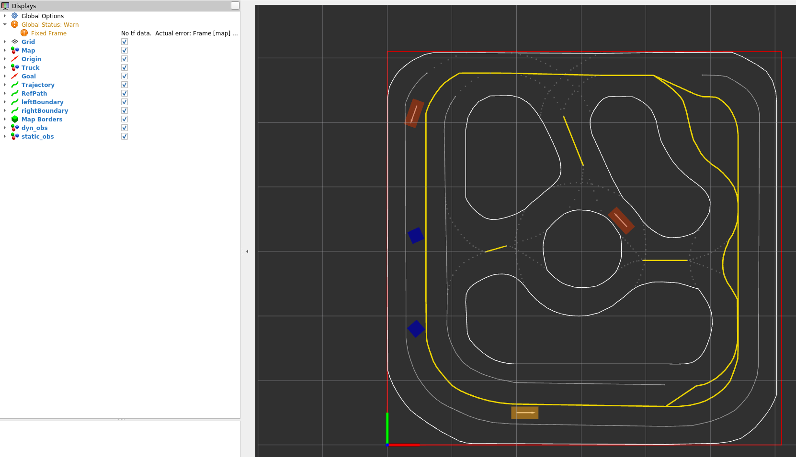
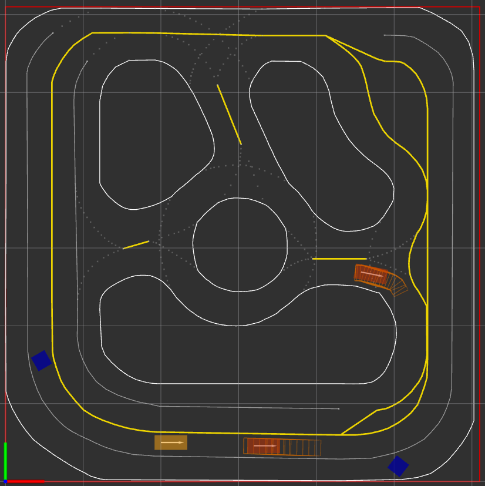

# Lab 3 - Collision Avoidance and Navigation in Dynamic Environments

**[Due 11:59PM Friday, March 20]**

In this lab, we will dive deeper into our ILQR trajectory planner. Specifically, we will introduce collision avoidance with static and dynamic obstacles. First, you will build upon your Lab 1 results and enable your robot to navigate around static obstacles. Then, we will integrate forward-reachable sets to allow your robot to interact with other agents through a traffic simulator.

There are **3 tasks** in this lab, and you will need to submit (push) your code and demo to a TA.

**Note**: Make sure you have **pulled the code from upstream** into your repository and rebuilt the Docker image. If git asks you to specify how to reconcile divergent branches, run this once:
```bash
git config pull.rebase false
```
Then pull and rebuild:
```bash
git pull upstream SP2026
./start.sh build
```

If you get a **merge conflict** on a file you modified (e.g. from Lab 1), you can resolve it by keeping your version:
```bash
git checkout --ours <path-to-conflicting-file>
git add <path-to-conflicting-file>
git commit
```

Then start the container and build the ROS 2 workspace:
```bash
./start.sh
# Inside the container:
cd /ros2_ws && colcon build --symlink-install && source install/setup.bash
```

## Before You Start

This lab builds directly on your Lab 1 ILQR implementation. You will need to **fill in the ILQR planner** and **Trajectory Planner** code in the Lab 3 directory. The Lab 3 codebase is a copy of Lab 1's structure with additional functionality for obstacle avoidance. Specifically, you must complete:

1. **ILQR `plan` function** in [`ece346/Lab3/scripts/ILQR/ilqr.py`](https://github.com/SafeRoboticsLab/ECE346/blob/SP2026/src/racecar_ece346/ece346/Lab3/scripts/ILQR/ilqr.py) -- Port your working ILQR implementation from Lab 1 into the `TODO 1` section.

2. **`compute_control` function** in [`ece346/Lab3/scripts/traj_planner.py`](https://github.com/SafeRoboticsLab/ECE346/blob/SP2026/src/racecar_ece346/ece346/Lab3/scripts/traj_planner.py) -- Port your feedback control implementation from Lab 1 into `TODO: Task 2`.

3. **`receding_horizon_planning_thread` function** in [`ece346/Lab3/scripts/traj_planner.py`](https://github.com/SafeRoboticsLab/ECE346/blob/SP2026/src/racecar_ece346/ece346/Lab3/scripts/traj_planner.py) -- Port your receding horizon planner from Lab 1 into `TODO: Task 3`.

Make sure your Lab 1 code works before starting Lab 3. Once you have ported your code, you can proceed with the tasks below.

## Software Structure

In this lab, a new node called `/traffic_simulation_node` is introduced in your workspace. This node (**Figure 1**) simulates static and dynamic obstacles and publishes them under the topics `/Obstacles/Static` and `/Obstacles/Dynamic`. Your trajectory planner will leverage these messages and pass them into ILQR for collision-free planning.


***Figure 1**: `/traffic_simulation_node` is added to the ROS workspace in Lab 3 and it publishes the `/Obstacles/Static` and `/Obstacles/Dynamic` topics*

The configuration file for this lab is located at `ece346/Lab3/config/lab3_launch.yaml`.

# Static Obstacles

In the first part of this lab, we will build collision avoidance functionality on top of your ILQR. After starting the Docker container, rebuilding, and sourcing the workspace, launch the ROS 2 nodes:
```bash
# Inside the Docker container:
cd /ros2_ws && colcon build --symlink-install && source install/setup.bash

# Set your ROS domain ID (replace <YOUR_ID> with your assigned number)
export ROS_DOMAIN_ID=<YOUR_ID>

# Launch simulation nodes
ros2 launch racecar_ece346 Lab3_simulation_launch.py
```

This will launch a simulation environment (**Figure 2**) with static obstacles (blue squares) and a dynamic obstacle.



***Figure 2**: Simulated environment with static obstacles*

## Task 1: Collision Avoidance with Static Obstacles

Recall that in Lab 1, you implemented a receding horizon planner inside the [`TrajectoryPlanner`](https://github.com/SafeRoboticsLab/ECE346/blob/SP2026/src/racecar_ece346/ece346/Lab3/scripts/traj_planner.py) class. We will now add the following features to this class:

### Adding the subscriber for static obstacles

1. Within your [`TrajectoryPlanner`](https://github.com/SafeRoboticsLab/ECE346/blob/SP2026/src/racecar_ece346/ece346/Lab3/scripts/traj_planner.py) class, read the **topic name** of static obstacles from the ROS 2 parameter `static_obstacles_topic` using `self.get_parameter()` and setting the default parameter as `/Obstacles/Static`.

2. Subscribe to the topic from step 1, with message type [`MarkerArray`](https://docs.ros2.org/foxy/api/visualization_msgs/msg/MarkerArray.html). This message contains a list of obstacles represented by a marker.

    Hint: You can use `ros2 interface show visualization_msgs/msg/MarkerArray` to inspect the data structure of the `MarkerArray` message.

    Hint: The callback function for this subscriber is a new one that is defined in step 4. You can call it `static_obstacle_callback`.

3. Initialize an empty **dictionary** (let's call it `static_obstacle_dict`) as a class variable, i.e., a variable that is shared by all instances of a class (in this case, it is your `TrajectoryPlanner`).

4. Create a callback function for the subscriber. Inside this callback function, retrieve **id** and **vertices** for each obstacle using the [`get_obstacle_vertices`](https://github.com/SafeRoboticsLab/ECE346/blob/SP2026/src/racecar_ece346/ece346/Lab3/scripts/utils/static_obstacle.py) helper function. Then, **add vertices to `static_obstacle_dict` whose key is the id of the obstacle**.

5. **(Optional)** Feel free to implement any reset strategies for the dictionary inside your callback function. For example, you can clear the dictionary every time the callback function is called or clear it every few seconds.

### Passing static obstacles into ILQR

Inside the [`receding_horizon_planning_thread`](https://github.com/SafeRoboticsLab/ECE346/blob/SP2026/src/racecar_ece346/ece346/Lab3/scripts/traj_planner.py) function:

1. At each time before replanning, initialize an empty list (let's call it `obstacles_list`).
2. Append all **values** from `self.static_obstacle_dict` into `obstacles_list`.
3. Pass `obstacles_list` into the ILQR planner using the `update_obstacles` function.

### Testing obstacle avoidance

Re-launch the simulation and select a goal point on the map using **2D Nav Goal** in RViz. The default parameters should be able to handle most static obstacles. If the robot runs off a corner, restart the simulation.

**Be prepared to demo your robot successfully avoiding the static obstacles to a TA.**

# Dynamic Obstacles

In addition to static obstacles, we must consider other agents as dynamic obstacles and avoid collisions with them. While we are unsure where other agents will be in the future, we can use forward reachable sets $\overrightarrow{\mathcal{R_t}}$ to model all possible future states and avoid them at each time step. Forward reachability analysis enables us to consider all possible states that another agent could be in the future. We can treat the forward reachable set (FRS) $\overrightarrow{\mathcal{R_t}}$ at each time instant as a static obstacle and use the same method from Task 1 to incorporate FRS information into the ILQR planner.

**Worst-Case Analysis.** We can compute the worst-case FRS concerning any possible controls. By avoiding FRSs at every time step within our planning horizon, your robot can avoid collision for any actions taken by other agents. However, this can make our planned trajectory very conservative and inefficient. For example, **Figure 3** shows the evolution of worst-case FRS. We can observe that worst-case FRS grows rapidly and occupies the entire road.


***Figure 3**: The evolution of the worst-case forward reachable set.*

**FRS with Predicted Policy.** Worst-case reachability analysis often leads to overly conservative planning. If we can acquire information about other agents' behavior, it is useful to incorporate it into our planning algorithm. Suppose we have computed an estimate of another agent's control policy $\pi^o \colon X \to U^o$. We assume the uncertainty in the other agent's behavior is well represented by an additive disturbance term $d^o_t$. In this case, by avoiding FRSs at every time step within our planning horizon, the robot can safeguard against all possible disturbances.

## Task 2: Multi-step Forward Reachable Set

Inside the file [`ece346/Lab3/scripts/frs.py`](https://github.com/SafeRoboticsLab/ECE346/blob/SP2026/src/racecar_ece346/ece346/Lab3/scripts/frs.py), we have implemented the majority of functionalities to compute FRS in the `FRS` class. For example, given a set, $A$ and $B$ matrices to represent dynamics, bounds of control/disturbance, and time step $d_t$, the `onestep_zonotope_reachset` function will calculate the FRS after $d_t$ seconds.

Your task is to finish the `multistep_zonotope_reachset` function in the `FRS` class following the instructions in the code. This function will calculate multiple-step reachable sets given an initial set.

You can use [`ece346/Lab3/scripts/task2.ipynb`](https://github.com/SafeRoboticsLab/ECE346/blob/SP2026/src/racecar_ece346/ece346/Lab3/scripts/task2.ipynb) to reproduce **Figure 4** and test your FRS implementation.


***Figure 4**: 20 Steps forward reachable sets with predictive policy projected to* $\hat{x}$ - $\hat{y}$ *plane*

#### Running the Notebook inside Docker

Follow the same steps as Lab 1:

1. Make sure your Docker container is running (via `./start.sh`).
2. Attach VS Code to the running container using **Dev Containers: Attach to Running Container**.
3. In the new VS Code window, navigate to `/ros2_ws/src/racecar_ece346/ece346/Lab3/scripts/`.
4. Open `task2.ipynb` and select the **Python 3.8** kernel.

## Task 3: Collision Avoidance with Dynamic Obstacles



***Figure 5**: Example result of Task 3*

In Task 3, we integrate the FRS computation with the trajectory planner. A dynamic obstacle node ([`ece346/Lab3/scripts/dyn_obs_node.py`](https://github.com/SafeRoboticsLab/ECE346/blob/SP2026/src/racecar_ece346/ece346/Lab3/scripts/dyn_obs_node.py)) and an FRS service client have already been set up in your `TrajectoryPlanner`. Inside your `receding_horizon_planning_thread`, you will need to:

1. Call the FRS service client to obtain other agents' FRSs. You can use the helper function `self.get_frs()`:

```python
request = t_cur + np.arange(self.planner.T) * self.planner.dt
response = self.get_frs(request)
```

2. Process the response using the helper function [`frs_to_obstacle`](https://github.com/SafeRoboticsLab/ECE346/blob/SP2026/src/racecar_ece346/ece346/Lab3/scripts/utils/dyn_obstacle.py). The output should be **extended** into your `obstacles_list` (the same list from Task 1) before sending it to the ILQR planner.

    **Hint**: See [append() and extend() in Python](https://www.geeksforgeeks.org/append-extend-python/) to learn the difference.

3. Use the helper function [`frs_to_msg`](https://github.com/SafeRoboticsLab/ECE346/blob/SP2026/src/racecar_ece346/ece346/Lab3/scripts/utils/dyn_obstacle.py) to generate visualization messages of FRSs. Publish the message with `self.frs_pub`.

    **Note**: To visualize the FRS in RViz, you need to manually add the topic. In the bottom-left panel of RViz, click **Add**, then select **By topic** and add the `/vis/FRS` `MarkerArray` topic.

Finally, test your collision avoidance by launching the simulation:
```bash
# Inside the Docker container:
cd /ros2_ws && colcon build --symlink-install && source install/setup.bash

# Set your ROS domain ID (replace <YOUR_ID> with your assigned number)
export ROS_DOMAIN_ID=<YOUR_ID>

# Launch simulation nodes
ros2 launch racecar_ece346 Lab3_simulation_launch.py
```

If everything works properly, you will see your robot moving around the track and avoiding collisions with other agents.

**Note:** At different areas of the track (such as in the inner circle), your robot may swerve in either direction to avoid the dynamic obstacle. This is normal behavior dictated by the costs of the obstacles in conjunction with the state and control costs. Tuning these costs is not expected of you until the final lab.

**Note:** The simulator, especially with dynamic obstacle avoidance, can be finnicky. Multiple retry attempts may be needed to show overtaking behavior.


## Submission

1. Demo to a TA: robot successfully avoiding static obstacles and continuing its path
2. Demo to a TA: robot successfully overtaking or avoiding a dynamic obstacle once
3. Push your completed code to your repository
